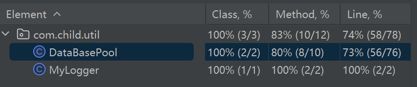

# 想法

- [x] 池化技术，减少资源获取与关闭地操作，进而提高性能
- [ ] 对象映射表字段，兼容性良好的实体与表通过框架的辅助提高了开发效率
    1. 遵守命名规范，java、mysql
    2. 在查询语句中进行字段替换
        1. 从开头进行查找下划线，直到from停止

- [ ] 控制事务，每一个会话都将控制一件事务，保证了数据的安全性
- [ ] 每个会话都包装了简单的操作sql语句的方法，提高开发效率
    1. 包装dml三个查询语句、包装selectone 和 selectList
    2. opensession方法用于获取连接
    3. connection开关在service类中，在dao中只开不关。
    4. 事务方面用于service
    5. 操作sql用于dao

- [ ] 通过注解获取简单sql语句，增强可读性
    1. 可以尝试在service中将sql写在注解上。
    2. 在调用dao类时，利用动态代理进行拦截，用于获取sql语句

- [x] 线程绑定资源
    1. 相关操作都在池中实现
    2. 在返回连接资源之前对资源进行绑定
    3. 在回收时将连接移除


# SqlSession类

1. `public SqlSession()`,用于获取`SqlSession`对象

2. `public Connection openSession()`方法用于获取连接资源

3. `public int insert(String sql, Object obj)`,用于插入`obj`对象，返回受影响行数

4. `public int delete(String sql, Object obj)`，同上

5. `public int update(String sql, Object obj)`，同上

6. `public Object selectOne(String sql, Object obj)`,返回查询记录对应的对象

7. `public List<Object> selectList(String sql)`，返`List`集合对象，储存了所有的查询记录

    


# DataBasePool类

## 开发流程1.0

1. 编写properties文件，用于声明数据库连接池的相关配置

    ~~~properties
    driverClassName=com.mysql.cj.jdbc.Driver
    #URL连接数据库的URL，
    url=jdbc:mysql://localhost:3306/db_01?rewriteBatchStatement=true
    
    #安装mysql时候设置的用户与密码
    username=root
    password=root
    
    #初始化物理连接的个数
    initialSize=10
    
    #空闲池小连接数
    minIdle=5
    
    #活跃时最大连接池数量
    maxActive=20
    
    #获取连接时最大等待时间
    maxWait=5000
    ~~~

2. 保存连接实例的集合选择并发队列：`ConcurrentLinkedQueue`

    1. 队列FIFO的特性，符合池中连接资源的获取与回收
    2. 不使用Set、Map是因为存储进去的是无序的，遍历浪费时间，且键值对也不是必须的，多一个value还浪费空间
    3. 不使用`TreeXxx`是因为不需要排序

3. 添加一个静态的日志，用于打印。

4. 声明一个`ResourceBundle`对象，用于获取相关资源。

5. 设置相关静态常量字段，用于声明相关配置数据。

    1. 包括`driver`,`url`,`user`,`pwd`,`initialSize`,`minIdle`,`maxActive`,`maxWait`

6. 设置两个静态字段，处于活跃可变状态

    1. 设置成员变量`presentMaxActive`记录活跃数量，该变量满足配置文件中`maxActive`属性

        特别的，该资源因为线程问题，加上了volatile关键字修饰，但实际操作时，为了满足原子性，还是选择上锁。

    2. 设置成员变量`isTimedOut`记录是否超时，该变量满足配置文件中`maxWait`属性

7. 设置空闲池，即`ConcurrentLinkedQueue`集合

    1. 空闲池满足`minIdle`属性
    2. 最开始时，空闲池默认初始化`initialSize`个连接实例

8. 通过静态代码块来完成初始化操作

    1. 包括注册、获取初始化资源

9. 核心公开静态方法`getConnection()`

    1. 以空闲池集合实例为锁，进行资源控制
    2. 设置线程来监控`getConnection()`方法中是否满足配置文件中的`maxWait`属性
    3. 调用三个辅助方法，用于检测是否满足配置要求
    4. 获取连接资源用`poll()`方法
    5. 每获取一个资源，令连接活跃数量自增

10. 重要公开静态方法一：`reclaim()`

    1. 利用`offer()`将连接资源回收，该方法与`poll()`方法正好对应。（头删尾增）
    2. 每回收一个资源，令连接活跃数量自减
    3. 返回值为引用类型Void，使其适用于泛型、反射。

11. 重要私有静态方法二：`getConnectionProxy()`

      1. 池中的所有资源都是调用该方法来获取的
      2. 通过动态代理获取连接资源
      3. 其中的代理方法设置调用连接资源的close()方法时，并不调用原本的`close()`方法，而是`DadaBasePool`中的`reclaim()`方法。

12. 编写三种异常类，

      1. `MinIdledException`，当满足`minIdle`时抛出异常
      2. `OverMaxActiveException`，当满足`maxActive`时抛出异常
      3. `TimedOutException`，当满足`maxWait`时抛出异常

13. 三个私有、静态的辅助方法

     1. 用于检测是否满足配置文件中的属性，并根据实际运行情况选择抛出异常或者返回null表示通过检测

     2. `isMinIdled()`，用于判断是否满足配置文件中的`minIdle`属性

        特殊地，该方法在检测到异常后，会选择补充连接资源，并且不影响程序的继续运行。

     3. `isOverMaxActive()`，用于判断是否满足配置文件中的`maxActive`属性

     4. `isTimedOut()`，用于判断是否满足配置文件中的`maxWait`属性

## 调用流程

1. 线程第一次调用时，将进行类加载
    1. 该步骤完成了所有静态字段、静态代码块的赋值操作
    2. 其中在池中增加资源，调用的是`getConnectionProxy()`方法获取来连接资源的代理类（该类的所有资源均通过调用该方法获取）
2. 线程通过`getConnection()`方法获取池中的资源
3. `getConnection()`，被调用之后，会为当前线程开启一个监听线程，用于监听获取连接是否超时
4. 获取连接时，线程再未出异常的情况下，将不断地竞争锁以求获取资源
5. 当线程得到锁之后，会经过三层检验，分别是`isOverMaxActive()`,`isMinIdled()`,`isTimedOut()`,
6. 若活跃资源达到`maxActive`，则抛出异常
7. 若池中资源到达`minIdle`，则补充资源，抛出异常，但是又自己捕捉异常
8. 若监听线程监听得知当前线程获取资源地时间超过了`maxWait`，则抛出异常
9. 若是通过三层检测，则返回一个资源的代理类，并使`presentMaxActive`自增，用于记录活跃数量
10. 当线程调用`close()`方法时,动态代理将进行拦截，强制调用`DataBasePool`内部的`reclaim()`方法来进行资源回收

## version1.1

加入ThreadLocal对线程进行资源绑定

1. 在获取资源时，添加判断代码，如果线程已经绑定了资源，直接返回。否则进行资源申请
2. 在回收资源时，将绑定资源进行移除


# 2023.3.3 DataBasePool

- [x] 1. 记录活跃数量利用atomic包下的累加器来完成自增自减
- [x] 1. 统一捕获异常，记录日志，再抛出去
- [ ] 1. ~~采用线程池~~。不合适，必须每个线程配备一个监听器
- [x] 使用lambda表达式简化代码


## 1. 需求

1. 在配置文件的要求下可以完成
    1. 池中初始化资源数量
    2. 控制资源最大活跃数量
    3. 最小空闲数量
    4. 获取资源的最大时长
2. 多线程环境下，可以安全获取连接资源
3. 用户线程获取资源后，需要将资源返回池中
4. 对于一些错误需要返回给调用者

## 2. 概要设计

```java
package com.child.util;

import com.child.exception.MinIdledException;
import com.child.exception.OverMaxActiveException;
import com.child.exception.TimedOutException;

import java.sql.Connection;
import java.util.ResourceBundle;
import java.util.concurrent.LinkedBlockingQueue;
import java.util.concurrent.atomic.LongAdder;
import java.util.logging.Logger;

/**
 * 用于获取连接池中空闲的连接。<br/>
 * <p/>
 * 关于字段：<br/>
 * 数据库连接池，利用池化技术来避免多次与数据库的物理连接与关闭，进而提升性能，并优化用户体验。<br/>
 * static与final结合，实现底层自动优化，即在类加载的准备阶段就会被赋上指定的字面量值。<br/>
 * 资源绑定器{@code ThreadLocal}，保证了一个线程在未释放资源前，每次获取到的连接都是同一个。<br/>
 * <p/>
 * 关于方法：<br/>
 * 核心方法 {@code getConnection()}用于返回连接资源，其中会保证多线程同步，并将经过三个自定义异常检测，
 * 分别是{@link MinIdledException}, {@link OverMaxActiveException}, {@link TimedOutException}。<br/>
 *
 * 重要方法一 {@code reclaim()}用于回收资源入池，并解除线程绑定资源。<br/>
 * 重要方法二 {@code getConnectionProxy()}用于获取连接的代理类，其中特别强调了在调用close方法时，
 * 调用的是本类中的{@code reclaim()}方法。<br/>
 *
 * @author silent_child
 * @version 1.0
 **/
public class DataBasePool {
    private static final Logger logger = ChildLogger.getLogger();// 日志
    private static final ResourceBundle resourceBundle = ResourceBundle.getBundle("dataBasePool-config");
    private static final String driver = resourceBundle.getString("driver");
    private static final String url = resourceBundle.getString("url");
    private static final String user = resourceBundle.getString("username");
    private static final String pwd = resourceBundle.getString("password");
    /**
     * 初始化连接数，默认为10
     */
    private static final int initialSize = Integer.parseInt(resourceBundle.getString("initialSize"));
    /**
     * 空闲池中最少连接资源数量，默认为5
     */
    private static final int minIdle = Integer.parseInt(resourceBundle.getString("minIdle"));
    /**
     * 活跃状态下的最大连接数，默认为20
     */
    private static final int maxActive = Integer.parseInt(resourceBundle.getString("maxActive"));
    /**
     * 最大连接时长，默认是5s
     */
    private static final int maxWait = Integer.parseInt(resourceBundle.getString("maxWait"));
    /**
     * 用于为线程绑定连接资源，使得每一个线程在未释放资源时，获取的都是同一个资源。
     */
    private static final ThreadLocal<Connection> threadLocal = new ThreadLocal<>();

    /**
     * 使用阻塞队列，线程安全，而且是队列数据结构，更符合池化技术。之所以不选择并发队列，是因为size()方法可能并不准确
     */
    private static final LinkedBlockingQueue<Connection> queue = new LinkedBlockingQueue<>();

    /**
     * 累加器，用于记录当前活跃连接数量
     */
    private static final LongAdder presentMaxActive = new LongAdder();


    static {
        // 注册数据库驱动

        // 获取初始化资源
    }


    /**
     * 用于从空闲池中获取连接资源。<br/>
     * <p/>
     * 以{@code queue}为锁，防止多线程并发获取连接。<br/>
     * 特别地，由于最小空闲数的存在，基本上都不会令阻塞队列在获取资源时发生阻塞。<br/>
     * @return {@link Connection}
     */
    public static Connection getConnection();

    /**
     * 用于获取连接的代理类。<br/>
     * <p/>
     * 代理方法中主要增加了：在调用代理对象的{@code close()}时，
     * 调用的是本类{@code DataBasePool}的方法——{@code reclaim()}。<br/>
     *
     * @return {@link Connection} 实际上返回的是一个连接的代理类
     */
    private static Connection getConnectionProxy();

    /**
     * 用于回收资源到空闲池<br/>
     * @param connection 需要回收的连接资源
     */
    public static Void reclaim(Connection connection);

    /**
     * 用于判断空闲连接数量是否低于{@code minIdle}。<br/>
     * <p/>
     * 在空闲连接数量小于等于{@code minIdle}时添加个数。个数cnt为 minIdle / 2 + 1。<br/>
     *
     * @throws MinIdledException 当空闲连接数量小于等于{@code minIdle}时，
     *                           抛出“已达最小空闲连接数量”异常。<br/>
     *                           但是异常不继续向上抛出，而是直接该方法内捕获。<br/>
     *                           故该方法不影响线程获取连接。<br/>
     */
    private static void isMinIdled() throws InterruptedException;

    /**
     * 用于判断活跃连接数量是否大于{@code maxActive}<br/>
     * <p/>
     *
     * @throws OverMaxActiveException 当活跃连接数量大于{@code maxActive}时，
     *                                抛出“连接数量已达阈值”异常
     */
    private static void isOverMaxActive();

    /**
     * 私有化构造器，防止外界创建DataBasePool对象
     */
    private DataBasePool() {
    }
}
```

## 3. 详细设计

### 3.1 isOverMaxActive

~~~java
    /**
      * 用于判断活跃连接数量是否大于{@code maxActive}<br/>
      * <p/>
      *
      * @throws OverMaxActiveException 当活跃连接数量大于{@code maxActive}时，
      *                                抛出“连接数量已达阈值”异常
      */
     private static void isOverMaxActive() {
         if (presentMaxActive.sum() >= maxActive) {// 当达到最大活跃数量时抛出异常
             throw new OverMaxActiveException("连接数量已达阈值");
         }
     }
~~~


### 3.2 isMinIdled

~~~java
	/**
     * 用于判断空闲连接数量是否低于{@code minIdle}。<br/>
     * <p/>
     * 在空闲连接数量小于等于{@code minIdle}时添加个数。个数cnt为 minIdle / 2 + 1。<br/>
     *
     * @throws MinIdledException 当空闲连接数量小于等于{@code minIdle}时，
     *                           抛出“已达最小空闲连接数量”异常。<br/>
     *                           但是异常不继续向上抛出，而是直接该方法内捕获。<br/>
     *                           故该方法不影响线程获取连接。<br/>
     * @throws InterruptedException 当阻塞队列到达边界线程阻塞，阻塞被打断时抛出异常。
     *                              但对于本方法来说不会出现此异常
     *
     */
    private static void isMinIdled() throws InterruptedException {
        if (queue.size() <= minIdle) {// 当达到最小空闲数量时，补充资源
            int cnt = minIdle / 2 + 1;// 设置补充资源的数量
            for (int i = 0; i < cnt; i++) {
                queue.put(getConnectionProxy());// 向池中添加资源
            }
            try {
                throw new MinIdledException("已到达最小空闲连接数");
            } catch (MinIdledException e) {
                logger.info(e.getMessage());
            }
        }
    }
~~~


### 3.3 reclaim

~~~java
	/**
     * 用于回收资源到空闲池<br/>
     * @param connection 需要回收的连接资源
     */
    public static Void reclaim(Connection connection) {
        threadLocal.remove();// 将当前线程解除资源绑定
        try {
            queue.put(connection);// 将连接资源放回池中
        } catch (InterruptedException e) {
            // 一般情况下不会出现该异常。因为一定会放回无界队列中
            throw new RuntimeException("中断阻塞队列的阻塞作用");
        }
        presentMaxActive.decrement();// 活跃数量累加器自减

        return null;
    }
~~~


### 3.4 getConnectionProxy

~~~java
	/**
     * 用于获取连接的代理类。<br/>
     * <p/>
     * 代理方法中主要增加了：在调用代理对象的{@code close()}时，
     * 调用的是本类{@code DataBasePool}的方法——{@code reclaim()}。<br/>
     *
     * @return {@link Connection} 实际上返回的是一个连接的代理类
     */
    private static Connection getConnectionProxy() {
        return (Connection) Proxy.newProxyInstance(Connection.class.getClassLoader(), new Class[]{Connection.class},
                new InvocationHandler() {
                    /**
                     * connection为代理类中的被代理对象。<br/>
                     * 用final修饰保证该对象不会再指向其他连接资源，
                     * 提高了池中的连接资源被反复获取与回收时的安全性。<br/>
                     * 不使用static的原因是，每个代理对象中，应该持有独有的一份连接资源，而不应该是共享的。<br/>
                     */
                    private final Connection connection;

                    {
                        try {
                            connection = DriverManager.getConnection(url, user, pwd);// 用于获取资源
                        } catch (SQLException e) {
                            throw new RuntimeException("连接资源入池失败");
                        }
                    }

                    @Override
                    public Object invoke(Object proxy, Method method, Object[] args) throws Throwable {
                        // 如果调用的是close方法，则调用自定义数据库连接池的reclaim方法
                        if ("close".equals(method.getName())) {
                            return reclaim((Connection) proxy);
                        }
                        // 如果是其他方法则无所谓了
                        return method.invoke(connection, args);
                    }
                });

    }
~~~


### 3.5 getConnection

~~~java
	/**
     * 用于从空闲池中获取连接资源。<br/>
     * <p/>
     * 以{@code queue}为锁，防止多线程并发获取连接。<br/>
     * 特别地，由于最小空闲数的存在，基本上都不会令阻塞队列在获取资源时发生阻塞。<br/>
     * @return {@link Connection}
     */
    public static Connection getConnection() {
        // 获取当前线程
        Thread currentThread = Thread.currentThread();
        // lambda表达式中捕获的值不可变，故用原子类来包装
        AtomicBoolean isTimeOut = new AtomicBoolean(false);
        // 获取当前线程的绑定资源
        Connection connection = threadLocal.get();
        // 若当前线程已绑定连接资源，则直接返回
        if (connection != null) {
            return connection;
        }

        Thread timer = new Thread(() -> {
            long start = System.currentTimeMillis();// 开始记录时间
            while(!Thread.currentThread().isInterrupted()){
                if ((System.currentTimeMillis() - start) >= maxWait) {
                    // 若线程处于活动中，该方法不会产生任何影响。若线程在获取资源时被阻塞，则会中断阻塞。
                    currentThread.interrupt();
                    isTimeOut.set(true);// 当线程未被阻塞时，该值才是用于判断超时的
                }
            }
        });
        timer.setDaemon(true);// 设置为守护线程
        timer.start();

        while (!currentThread.isInterrupted()) {
            // 该处上锁是为了保证接下来的一系列事务的原子性，而不是为了保证数据修改的安全性
            synchronized (queue) {
                try {
                    
                    if (isTimeOut.get()) throw new TimedOutException("连接超时");
                    isOverMaxActive();// 判断是否超过最大活跃数
                    isMinIdled();// 是否低于最小空闲数

                    connection = queue.take();// 获取资源
                    threadLocal.set(connection);// 线程绑定资源
                    presentMaxActive.increment();// 活跃数量累加器自增
                    return connection;

                }
                catch (InterruptedException e) {// 一般来说，只要最小连接数量不为负数，就不会出现阻塞的情况
                    logger.info("获取资源被阻塞，导致超时");
                    throw new TimedOutException("获取资源被阻塞，导致超时");
                }
                // 以下代码可以继续向上抛出，直到抛给controller层来调度view层展示信息
                catch (RuntimeException e) {
                    logger.info("连接失败:" + e.getMessage());// 记录日志
                    throw e;
                }
            }
        }
        return null;
    }
~~~


### 3.6 clinit

```java
static {
    try {
        // 注册数据库驱动
        Class.forName(driver);
    } catch (ClassNotFoundException e) {
        throw new RuntimeException(e);
    }
    // 获取初始化资源
    for (int i = 0; i < initialSize; i++) {
        queue.offer(getConnectionProxy());
    }
    logger.info("数据库连接池初始化完毕");

}
```


## 4. 测试

### 4.1 testGetConnection1

~~~java
	/**
     * 设置20个线程，每个线程进行测试：<br/>
     * 在不关闭资源情况下获取到的是同一资源；<br/>
     * <p/>
     * 测试结果：能够满足预期值。<br/>
     */
    @Test
    void testGetConnection1() {
        for (int i = 0; i < 20; i++) {
            new Thread(() -> {
                // 测试同一资源
                Connection expected = DataBasePool.getConnection();// 期望值，未关闭资源前所获取的所有连接都是同一个
                Connection actual = DataBasePool.getConnection();// 实际值，再次获取一个资源
                Assertions.assertSame(expected, actual);// 下断言，每个资源都是同一个
            }).start();// 开启线程
        }
        try {
            Thread.sleep(500);
        } catch (InterruptedException e) {
            throw new RuntimeException(e);
        }
    }
~~~


### 4.2 testGetConnection2

~~~java
    /**
     * 设置20个以上线程，每个线程进行测试：<br/>
     * 先获取一个资源记录资源地址，然后关闭资源，再次获取一个资源。此时获取到的是不同资源。<br/>
     * <p/>
     * 测试结果：在非公平锁且池中资源量小的情况下，可能会出现拿到同一资源。<br/>
     */
    @Test
    void testGetConnection2() {
        for (int i = 0; i < 35; i++) {
            new Thread(() -> {
                // 测试同一资源
                Connection expected = DataBasePool.getConnection();// 期望值，未关闭资源前所获取的所有连接都是同一个
                try {
                    expected.close();
                } catch (SQLException e) {
                    throw new RuntimeException(e);
                }
                Connection actual = DataBasePool.getConnection();// 实际值，再次获取一个资源
                Assertions.assertNotSame(expected, actual);// 下断言，每个资源都是同一个
            }).start();// 开启线程
        }
        try {
            Thread.sleep(500);
        } catch (InterruptedException e) {
            throw new RuntimeException(e);
        }
    }
~~~


### 4.3 覆盖率



### 4.4 超时测试

该测试由于我不能模拟真实情况，故只能采用这种手动设置

#### 4.4.1 测试未阻塞

测试未阻塞的情况下的超时

1. 首先在synchronized内设置5s睡眠
2. 然后将会抛出超时异常

~~~java
public static Connection getConnection() {
    // 获取当前线程
    Thread currentThread = Thread.currentThread();
    // lambda表达式中捕获的值不可变，故用原子类来包装
    AtomicBoolean isTimeOut = new AtomicBoolean(false);

    Thread timer = new Thread(() -> {
        long start = System.currentTimeMillis();// 开始记录时间
        while(!Thread.currentThread().isInterrupted()){
            if ((System.currentTimeMillis() - start) >= maxWait) {
                // 若线程处于活动中，该方法不会产生任何影响。若线程在获取资源时被阻塞，则会中断阻塞。
                currentThread.interrupt();
                isTimeOut.set(true);// 当线程未被阻塞时，该值才是用于判断超时的
            }
        }
    });
    timer.setDaemon(true);// 设置为守护线程
    timer.start();

    while (!currentThread.isInterrupted()) {
        // 该处上锁是为了保证接下来的一系列事务的原子性，而不是为了保证数据修改的安全性
        synchronized (queue) {
            try {
                Thread.sleep(5000);
            } catch (InterruptedException e) {
            }
            try {
                // 判断超时，超时则直接抛出异常
                if (isTimeOut.get()) throw new TimedOutException("连接超时");

            }
            catch (RuntimeException e) {
                logger.info("连接失败:" + e.getMessage());// 记录日志
                throw e;
            }
        }
    }
    return null;
}
public static void main(String[] args) {
    getConnection();
}
~~~


#### 4.4.2 测试阻塞

测试阻塞的情况下的超时

1. 将初始化数量设置为0
2. 检验最小空闲数量取消

```java
static {
    // 获取初始化资源
    for (int i = 0; i < 0; i++) {
        queue.offer(getConnectionProxy());
    }
}
public static Connection getConnection() {
    // 获取当前线程
    Thread currentThread = Thread.currentThread();
    // lambda表达式中捕获的值不可变，故用原子类来包装
    AtomicBoolean isTimeOut = new AtomicBoolean(false);

    Thread timer = new Thread(() -> {
        long start = System.currentTimeMillis();// 开始记录时间
        while(!Thread.currentThread().isInterrupted()){
            if ((System.currentTimeMillis() - start) >= maxWait) {
                // 若线程处于活动中，该方法不会产生任何影响。若线程在获取资源时被阻塞，则会中断阻塞。
                currentThread.interrupt();
                isTimeOut.set(true);// 当线程未被阻塞时，该值才是用于判断超时的
            }
        }
    });
    timer.setDaemon(true);// 设置为守护线程
    timer.start();

    while (!currentThread.isInterrupted()) {
        // 该处上锁是为了保证接下来的一系列事务的原子性，而不是为了保证数据修改的安全性
        synchronized (queue) {
            try {
				// isMinIdled();// 是否低于最小空闲数
                connection = queue.take();// 获取资源
            }
            catch (InterruptedException e) {// 一般来说，只要最小连接数量不为负数，就不会出现阻塞的情况
                logger.info("获取资源被阻塞，导致超时");
                throw new TimedOutException("获取资源被阻塞，导致超时");
            }
        }
    }
    return null;
}
public static void main(String[] args) {
    getConnection();
}
```


# 2023.3.3 SqlSession

## 1. 需求

- [ ] 对象映射表字段，兼容性良好的实体与表通过框架的辅助提高了开发效率

    1. 遵守命名规范，java、mysql
    2. 在查询语句中进行字段替换
        1. 从开头进行查找下划线，直到from停止

- [ ] 控制事务，每一个会话都将控制一件事务，保证了数据的安全性

- [x] 每个会话都包装了简单的操作sql语句的方法，提高开发效率

    1. 包装dml三个查询语句、包装selectone 和 selectList
    2. opensession方法用于获取连接
    3. connection开关在service类中，在dao中只开不关。

    

    1. 事务方面用于service
    2. 操作sql用于dao

- [ ] 

## 2. 概要设计

~~~java
package com.child.util;

import java.sql.Connection;
import java.util.List;

/**
 * 该sql会话主要用于对数据库进行一系列的操作。集成了操作数据库必要的功能。<br/>
 * 该类中的异常均向上抛出，交由调用者进行处理。<br/>
 * SqlSession的作用域应该是局部的，即用完就应该销毁。<br/>
 */
public class SqlSession {
    /**
     * 每一个sqlSession实例只能拿到一个连接资源。
     */
    private static Connection connection;
    /**
     * 每一个sqlSession实例都拥有一份对应mapper的所有语句。
     */
    private static final Map<String, String> map = new HashMap<>();

    /**
     * 用于获取SqlSession对象
     */
    public SqlSession() {

    }

    /**
     * 用于获取连接资源
     *
     * @return boolean 用于判断资源是否开启成功
     */
    public boolean openSession() throws Throwable {
        try {
            connection = ChildDataSource.getConnection();
        } catch (Exception e) {
            Throwable throwable = new RuntimeException("资源开启失败" + e.getMessage());
            throwable.initCause(e);
            throw throwable;
        }
        return true;
    }

    /**
     * 用于关闭会话。<br/>
     * <p/>
     * 内部将会把连接释放。
     */
    public void close() {

    }

    /**
     * 提交事务。
     */
    public void commit() {

    }

    /**
     * 回滚事务
     */
    public void rollback() {

    }

    /**
     * 用于插入obj对象记录，返回受影响行数。
     * <p/>
     * @param statement sql语句的一个映射，即sql语句的位置。
     * @param obj 需要插入的对象
     * @return int 返回受影响行数
     */
    public int insert(String statement, Object obj) {
        return 0;
    }

    /**
     * 用于删除obj对象记录，返回受影响行数。
     * <p/>
     * @param statement sql语句的一个映射，即sql语句的位置。
     * @param obj 需要删除的对象
     * @return int 返回受影响行数
     */
    public int delete(String statement, Object obj) {
        return 0;
    }

    /**
     * 用于更新obj对象记录，返回受影响行数。
     * <p/>
     * @param statement sql语句的一个映射，即sql语句的位置。
     * @param obj 需要更新的对象
     * @return int 返回受影响行数
     */
    public int update(String statement, Object obj) {
        return 0;
    }

    /**
     * 用于插入obj对象记录，返回查询得到的对象。
     * <p/>
     * @param statement sql语句的一个映射，即sql语句的位置。
     * @param obj 需要查询的对象
     * @return Object 返回查询得到的对象
     */
    public Object selectOne(String statement, Object obj) {
        return null;
    }

    /**
     * 用于插入obj对象记录，返回查询得到的所有对象。
     * <p/>
     * @param statement sql语句的一个映射，即sql语句的位置。
     * @return List<Object> 返回查询得到的所有对象
     */
    public List<Object> selectList(String statement) {
        return null;
    }

}
~~~


## 3. 详细设计

### 3.1 openSession

~~~java
	/**
     * 用于获取连接资源.
     *
     * @return boolean 用于判断资源是否开启成功
     * @throws Throwable 抛出包装了具体异常原因的包装器
     */
    public boolean openSession() throws Throwable {
        try {
            connection = DataBasePool.getConnection();// 获取资源
            connection.setAutoCommit(false);// 设置为手动提交事务
        } catch (Exception e) {
            Throwable throwable = new RuntimeException("资源开启失败" + e.getMessage());
            throwable.initCause(e);// 设置具体异常原因
            throw throwable;// 向上抛出
        }
        return true;// 成功获取资源时返回true
    }
~~~

### 3.2 关闭、提交、回滚

~~~java
	/**
     * 用于关闭会话。<br/>
     * <p/>
     * 内部将会把连接释放。
     */
    public void close() throws SQLException {
        connection.close();
    }

    /**
     * 提交事务。
     */
    public void commit() throws SQLException {
        connection.commit();
    }

    /**
     * 回滚事务。
     */
    public void rollback() throws SQLException {
        connection.rollback();
    }	
~~~


# 2023.3.4


1. service层调用SqlSession开启事务
    1. SqlSession作用域为请求域，用完即销毁。
2. service层调用dao类操作数据库
    1. dao类作用域为应用域，每个service类持有一个dao类
3. dao类调用SqlSession类操作数据库
    1. SqlSessio类作用域为请求域，用完即销毁。
4. service层调用SqlSession提交事务，关闭资源


1. dao类中的每个方法中基本上就三行代码

    ~~~java
    public int insert(UserPO userPO) {
        SqlSession sqlSession = new SqlSession();// 获取会话
        sqlSession.openSession();// 开启连接
        // 执行sql操作，返回受影响行数
        return sqlSession.insert("com.child.dao.UserDAO.insert", userPO);
    }
    ~~~

2. 基本上根据具体情况，只需要改动最后一行。


1. 由于每次请求（获取会话），sql语句都有可能在xml中改变，故每一次获取sql语句都应该重新检索xml文件
2. 但是如果请求变多的话，每次创建SqlSession就解析一遍xml文件，效率可能太低了。
3. 但是对于我这种数据量小的情况下还是就这么做吧。


1. 替换po属性为表字段
    1. 查找sql语句中的属性，将其全部替换为表字段规范即可
2. 替换占位符#{}为?
3. 获取jdbc接受的sql语句


1. 一个公开的方法，用于接收文件路径。
2. 将路径传给一个解析器，解析xml文件。
3. 将该文件的sql语句收集到Map集合中
4. 返回一个dao代理类


1. 放置sql语句的Map集合设置为静态放在SqlSession类中
2. 且获取Map的语句出现在静态代码块中
3. 这样意味着实际上只能解析一次xml文件
4. 意味着以后对xml文件改动，map集合也不会再改动
5. 但是对于mybatis，在Builder类中进行解析，将集合放在Factory。所以每次重建Factory就可以得到最新的sql语句。


# 2023.3.5

## mybatis分析

再次对mybatis的源码翻看了一波，首先梳理一下调用关系

1. 创建Builder，根据资源路径build出一个Factory

2. 每一个Factory类都含有所有资源的所有信息

    1. 会通过资源创建执行器Executor
    2. 事务管理工厂和管理器TransactionFactory和Transaction

    >至此已经开始划分两条路
    >
    >1. 执行器完成具体sql操作
    >2. 事务管理器视作java与数据库的桥梁（虽然实际上事务管理器也是通过execute来执行使用的）

3. Factory类将自身的数据备份一份，且多加上执行器、事务管理器等传递给Session类

    1. 如上面引用所讲，Session类中的方法，都将围绕执行器和事务管理开展

> 特别地mybatis中很有趣的地方就是open方法，有些地方是通过open方法来**得到资源或者获取资源的使用权**的。比如SqlSessionFactory获取会话类，Transaction获取资源

## 模拟orm

然后回过头来规划目前模仿的orm框架结构

1. 现有`parseMapperHandler`解析器来解析mapper.xml文件到Map集合中

2. 有`DataBasePool`实现了DataSource接口，用作数据库连接池

3. 打算编写`Transaction`类直接用，而不需要通过Factory根据不同的配置来生产不同的事务管理器

    > 1. 因为该orm并未使用mybatis-config.xml文件，故并没有environment中datasource、transaction等配置，故也不需要通过工厂类。
    > 2. 假设要用工厂类的话，那么跟SqlSessionFactory差不多，也是保存着资源文件中的transaction标签内的属性。
    > 3. 然后每创建tansaction事务管理器，Factory都复制数据给他们

    目前来说，事务管理器中包含了DataSource数据库连接池对象，以及Connection对象（该对象是从DataSource中取出来的）

    然后事故管理器就应该包含提交、关闭、回滚、获取连接等方法

4. Factory类包含事务管理器和映射语句集合。含有open方法来获取Session类

5. 每个Session类都持有Factory类数据的备份。

6. 目前来说没有执行器Executor类，打算直接在Session类内部操作。

7. 目前来说需要注意的是线程绑定资源ThreadLocal的时机，因为SqlSession类并不是在一次事务中只使用一次。

    1. 因为在服务层中需要创建Session类开启、关闭事务等操作
    2. 在dao层需要创建Session类执行sql操作
    3. 故如果不资源绑定的话那么需要在一次事务中创建两次Session类，这样的话，又由于每次创建Session类都会备份Factory中的所有数据，使得效率低。

    > 在mybatis中建议Session类的作用域为请求域，也就是作为局部变量使用。

## 不足

再总结一波这样缩减框架的不足

1. 没有使用总体的配置文件，比如mybatis-config.xml
2. 事务管理器不够灵活，因为没有工厂类，故无法根据配置文件的不同而创建不同的事务管理器。

1. 没有创建Executor，可能没有做到足够的单一职责原则。

    1. 因为所谓执行器就是来执行任务的
    2. 所谓会话就是开启一段时空来让其他人执行任务，而不应该让会话本身来执行任务。

2. 其他的一些类，比如会话类、工厂类的接口都没有写，并没有做到依赖倒置原则

    > 主要是格局问题，规划问题，自己的目标定在哪里很重要。之所以要减少耦合就是为了扩展性、灵活性，但如果自己只是想完成一个订制版本的orm，那自然就不会考虑接口、工厂类这种事情。


但是！如果需要解决这些问题的话，其实思路照搬mybatis就可以了

1. 其中对于灵活性、扩展性的问题，需要编写config.xml文件和Buidler类
    1. 将environment写上，Buidler类通过xml路径解析即可。
    2. 当然也不是完全不需要改动源码（还是有点耦合的），但是应该也可以很快改好


## 问题

1. Transaction中的方法要不要判断null再进行操作？
2. 没细看源码Transaction的调用关系，在写自己的orm发现好像getConenction不需要？似乎只要open就好
    1. 因为我的orm好像是直接通过transaction就操作了，无需再额外的得到Connection再操作。


# 2023.3.6

- [x] 编写sqlSession接口 、Factory接口
- [x] 在Factory内绑定Session资源
- [x] 编写工具类保存多个Factory资源，保证唯一性
- [x] 首先util类直接就相当于代替builder类，但是工具类又多了很多的功能。
    1. 其一，有map来收集所有的Factory以保证每个工厂类的唯一性。
    2. 其二，多了一个方法，即继承Builder类build方法，Factory类open方法，然后直接返回一个sqlSession，该方法在执行build方法前，需要先看一看map集合中是否已经存在factory。
- [x] 由于有了工具类，那么就可以直接把解析方法直接写到工具类中，当做静态方法。
- [x] 由于没有config配置文件的缘故，所以没有environment的id，故传给build方法的参数是自制数据库连接池的资源路径(全限定类名)，通过该参数来判断工厂类是哪一个factory在开启会话的时候，应该也自动开启连接资源。故传入的事务管理器应该是已经从连接池中获取资源的了。


# 2023.3.7

- [x] 关于SAX
    start是解析标签属性
    所以要添加resultType的解析
    charact是解析标签值
    end是汇总操作

- [x] 主要是获取包下的所有类
    通过包名点转斜杠得到对应的url
    url解码得到对应的的文件路径
    最后传入文件路径和文件名来进一步解析
    url为什么要通过协议解码
    通过文件过滤器得到指定文件或者判断还有子目录

- [x] 解析字符串
    获取所有属性名，对字符串进行搜索，搜索得到sql语句中属性名的索引，嵌套循环，找到该属性索引范围内的大写字母进行替换。


# 2023.3.8

还需要完成的任务：

- [x] 标签属性resultType要加到`MapperStatement`类中作为字段
- [x] 在`ParseMapperHandler`中要解析该标签属性
- [x] **`SimpleSqlSession`中还需要编写查询语句**
- [x] 在`UserDAO`中添加相关查询方法、在UserMapper.xml中加入相关sql语句，然后进行测试。

- [x] 在使用手册中，添加mapper.xml文件的使用方法
- [ ] 编写概要设计
- [ ] 编写详细设计，同时进行单元测试
    - [x] 单元测试首先是对JDBCTransaction，
    - [x] 然后是Factory，根据构造器进行创建。
    - [x] session，该测试需要处理很多东西，首先是要创建连接池对象，然后是创建transaction，再然后是添加一个Map集合。然后才能开始创建session对象。
    - [x] util，对于build可以直接测试。对于open需要测试不同的数据库连接池。其中包含了几个辅助方法。也需要注意测试
        可以明确的定义一个是从包名获取xml，一个是从directory获得xml文件。最终都是通过文件目录得到的。通过lastindexof来截取.之前的文件名。加载类才需要包名，简单的得到.xml文件并不需要包名。
    - [x] 还要测试表字段为下划线的情况
- [ ] 查询前也要openConnection，同理需要解析sql语句，基本上和update差不多。但是后面开始执行的时候有所不同，要执行executequery，并拿到返回的resultSet。然后一般来说是返回传入的参数类型。返回的查询结果是对应sql语句前半段属性字段。所以可以将其记录下来，然后后续再反射获取对应的set方法，然后进行赋值。对于resultSet还有meta信息，可以通过此来得到对应V，(在update对sql进行替换时，将对应的值放入map中存放，后续result需要用到。用表字段作k，pojo字段作v)
    去看一看源码中select和selectlist有什么关系
- [ ] 想实现多param，那么就得实现map集合参数形式，然后利用动态代理即可实现多参数
    有没有一种可能，直接在方法上加上注解，然后利用键值对的形式完成传参


# 2023.3.9

1. 对于解析sql语句，在此之前，写的方法都是针对接收一个Object类来实现的
2. 那么如果需要添加多参数怎么办，此时无法通过反射进行解析了
    1. 可以尝试采用策略模式，即原先的解析类还可以继续使用，但是需要继承一个父类或者接口，
    2. 然后可以解析多参数的解析类，也继承该接口，
    3. 然后重构之前的代码就是，判断使用哪种策略。然后传入不同的具体策略即可。
    4. 主要的两种其实就是传入Object和传入Map


- [ ] 处理器，根据Object或者map进行传参。
- [ ] 先写出正常处理单参数传入map的情况。
- [ ] 然后检测到有注解，再额外处理成map即可当做单参数map调用已写好的方法。
- [ ] 处理Object直接传入一个class类对象即可进行处理，将原始sql变为jdbcsql。
- [ ] 接下来是处理map，这个比较简单，根据键值对进行处理即可。(在此之前，需要编写一个规范，就是关于表字段与占位符中字段，字面量必须相同。这样就可以以占位符中的字面量来将符合java规范的字段名转为符合数据库规范的字段名。)
- [ ] 同时，占位符中的字面量应该与注解中的值一致。
- [ ] 届时在传入的单参数map中，k是占位符中的字面量，v是传给？的值。之后根据次序进行传值即可。(此处关于两个map的处理和注解两个map的处理不同，注意不要混淆。）
- [x] 解析sql和传值，两个方法都会对应两个版本。
- [ ] 先抽离出方法，然后测试一下。
- [ ] 然后写Object版本的select测试一遍。
- [ ] 结束了在写传单map
- [ ] 最后再写注解，实现多参数。

# 2023.3.10

connection.close()不意味着真的要销毁conn，⽽是要把conn放回连接池，供下⼀次使⽤，既然还要使 ⽤，⾃然就需要重置AutoCommit属性了。


# 2023.3.11

1. 会话类中需要解决SqlHandler的问题，可能需要使用策略模式和动态代理
2. 会话工具类需要解决动态代理dao实现类的问题，需要解决多参数封装到map中
3. SqlHandler需要解决接口声明的问题，即解决只声明一种方法，主要是解决Map的问题


SimpleSqlSession代理类的作用是为了选择具体的SqlHandler

**失败，未实现代理类，会出现压栈最终栈溢出。最终使用一个方法在每次进行CRUD时调用该方法来选择具体的SqlHandler**


dao代理类的作用是为了将传入的实参转换为单个的Object或者Map

**失败，同理，会栈溢出。最终也是使用一个方法，放在DAOImpl类中的每一个方法中，用于实现实参转换为单个的Object和Map**


# 框架关系


## 介绍

目前只有Simple实现类，故接下来的使用将针对Simple实现类进行说明。

但是如果有需要的话，可以根据三个接口`Transaction`、`SqlSessionFactory`、`SqlSession`的规范以及SQL映射文件的规范再实现另一套使用方法。相关规范参见《框架关系-使用规范》


## 使用手册

1. 通过工具类`SqlSessionUtil`可以创建含有指定数据库环境的会话工厂类`SqlSessionFactory`
2. 通过会话工厂类可以开启一段会话，即创建一个会话类
3. 通过会话可以对数据库进行操作，例如：提交事务、回滚事务、关闭连接、CRUD操作


1. 作用域
    1. 工厂类的作用域最好限制在**应用域**范围之内，故在应用运行期间，最好只存在一种会话工厂类，即每种数据库环境只能创建一种工厂类
    2. 同时，对于会话类来说，其作用域应该在**请求域**范围，即会话类应该作为局部变量，在需要时创建，不需要时立即销毁。
    3. 由于事务管理器存在于会话类中，故其作用域在也相当于在**请求域**中
    4. 但是对于事务管理器所拥有的数据库连接池，它实际上是工厂类所持有，事务管理器拥有的是对工厂类中数据库连接池的访问权。故实际上数据库连接池对象的作用域和工厂类一致，应该是**应用域**。

2. SQL映射文件规范
    1. SQL映射文件应该放在dao包下
    2. 文件名最好以对应dao层接口名去掉`DAO`后为映射文件名的开头，后面再加上Mapper.xml的后缀。例如`UserMapper.xml`
    3. SQL映射文件中，根标签是`<mapper></mapper>`，其中具有**属性`namespace`，该属性应该是对应`DAO`接口的全限定类名**。例如`<mapper namespace="com.child.dao.UserDAO"></mapper>`
    4. 在根标签内可以有多个CRUD子标签，其中每个标签都有**用于定位的唯一id属性，该属性应该是对应`DAO`接口中声明的方法名**。如`<insert id="insert"></insert>`,`<delete id="deleteById"></delete>`
    5. 除此之外，每个CRUD标签内还可以填写**返回值类型属性，该属性应该对应类型的全限定类名**。如`<select id="selectById" resultType="com.child.pojo.User"></select>`
    6. 在标签的写的sql语句，应该可以通过占位符`#{}`来完成传参。
        1. 但需要注意的是，占位符内的字符串应该是对应对象的字段名。
        2. 在指定表字段时，采用对应对象的字段名当作表字段名即可。在底层处理中实现了对象字段与表字段的转换。但需要知道的是，对象和表中字段名的命名都应该符合各自的规范。

需要注意的是：

1. 如果通过`JDBCTransaction#setAutoCommit()`更改事务提交，那么您应该重新获取一个新的资源，以便将事务提交方式作用于新的连接资源上。


## 详细设计

工具类


会话类

crud、三个事务。一个open


虽然说，在service层和dao层都通过工具类拿到了同一个工厂开启的同一会话类，且得到的连接资源，由于数据库连接池的优化，使得拿到的还是同一资源。


会话工厂类

一个open，获取会话类


事务管理器

getConnection获取资源，以及三个事务


数据库连接池


SQL映射对象


SAX解析器


## 使用规范

### 1. SQL映射文件规范

1. SQL映射文件应该放在dao包下
2. 文件名最好以对应dao层接口名去掉`DAO`后为映射文件名的开头，后面再加上Mapper.xml的后缀。例如`UserMapper.xml`
3. SQL映射文件中，根标签是`<mapper></mapper>`，其中具有**属性`namespace`，该属性应该是对应`DAO`接口的全限定类名**。例如`<mapper namespace="com.child.dao.UserDAO"></mapper>`
4. 在根标签内可以有多个CRUD子标签，其中每个标签都有**用于定位的唯一id属性，该属性应该是对应`DAO`接口中声明的方法名**。如`<insert id="insert"></insert>`,`<delete id="deleteById"></delete>`
5. 除此之外，每个CRUD标签内还可以填写**返回值类型属性，该属性应该对应类型的全限定类名**。如`<select id="selectById" resultType="com.child.pojo.User"></select>`


### 2. `SqlSessionFactory`规范

~~~java
/**
 * 作为每一个SqlSessionFactory实例的顶级接口，声明了每一个实例都应该拥有的方法。<br/>
 * <p/>
 * 注意每一个SqlSessionFactory实例的作用域应该是应用域范围。<br/>
 * @author silent_child
 * @version 1.0
 **/
public interface SqlSessionFactory {
    /**
     * 开启会话。默认手动提交事务
     * @return {@link SqlSession}
     */
    SqlSession openSession();

    /**
     * 开启会话，设置提交事务方式
     * @param autoCommit 提交事务的方式，true为自动提交，false为手动提交。
     * @return {@link SqlSession}
     */
    SqlSession openSession(boolean autoCommit);

}
~~~

### 3. 对于`SqlSession`规范

~~~java
import java.sql.SQLException;
import java.util.List;

/**
 * SqlSession实例的顶级接口，声明了每个SqlSession实例都应该拥有的方法。<br/>
 * <p/>
 * 需要注意的是，对于提交事务相关的异常直接向上抛出，不在内部进行额外的处理。<br/>
 * 并且每一个SqlSession实例的作用范围应该是请求域，即局部作用域。<br/>
 * @author silent_child
 * @version 1.0
 **/

public interface SqlSession {
    /**
     * 用于关闭会话。
     */
    void close() throws SQLException;

    /**
     * 提交事务。
     */
    void commit() throws SQLException;

    /**
     * 回滚事务。
     */
    void rollback() throws SQLException;

    /**
     * 用于插入parameters对象记录，返回受影响行数。
     */
    int insert(String sqlId, Object parameters) throws SQLException;

    /**
     * 用于删除parameters对象记录，返回受影响行数。
     */
    int delete(String sqlId, Object parameters) throws SQLException;

    /**
     * 用于更新parameters对象记录，返回受影响行数。
     */
    int update(String sqlId, Object parameters) throws SQLException;

    /**
     * 用于插入parameters对象记录，返回查询得到的对象。
     */
    Object selectOne(String sqlId, Object parameters);

    /**
     * 用于插入parameters对象记录，返回查询得到的所有对象。
     */
    List<Object> selectList(String sqlId);
}

~~~

### 4. 对于`Transaction`规范

~~~java
import java.sql.Connection;
import java.sql.SQLException;

/**
 * 事务管理器接口，定义了管理事务的相关方法。<br/>
 * <p/>
 * 需要注意的是，实现该接口的所有方法将不处理任何异常，直接向上抛出交由调用者处理。<br/>
 * 注意，每一个{@link SimpleSqlSession}都应该持有一个全新的事务管理器。<br/>
 * 事务管理器的作用域也应该是请求域范围。<br/>
 *
 * @author silent_child
 * @version 1.0
 **/

public interface Transaction {
    /**
     * 通过调用{@code openConnection()}方法来开启资源，再返回获取得到的连接资源
     */
    Connection getConnection() throws SQLException;

    /**
     * 用于关闭连接资源
     */
    void close() throws SQLException;

    /**
     * 用于提交事务
     */
    void commit() throws SQLException;

    /**
     * 用于回滚事务
     */
    void rollback() throws SQLException;

}
~~~

